# Laporan pertemuan ke -1 sistem operasi
**Tanggal:** 18 Februari 2026  
**Disusun Oleh:** Mukhammad Raffi Zabra
**NIM:** 254107020059
**Kelas/No:** TI-1G/24

## 1. Praktikum 2.1 — instalasi virtual box
1. download oracle virtual box:
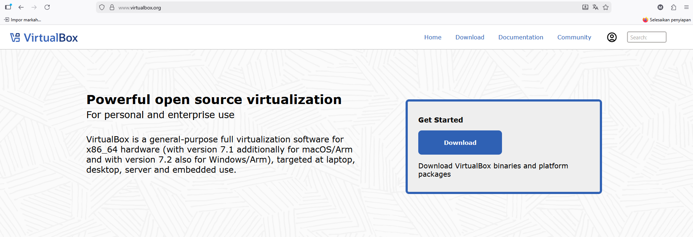

2. install virtual box:

- 

- 

- 

- 

- 

- 

- 

- 

## 2. Praktikum 2.2 - Instalasi Ubuntu server di virtual box

- 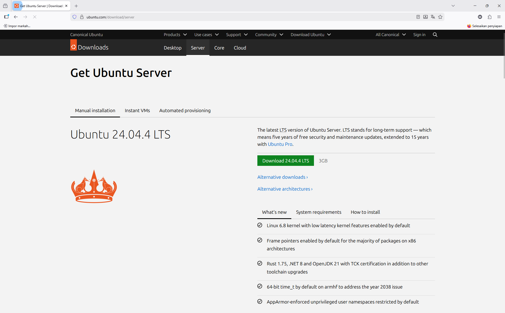

- 

- 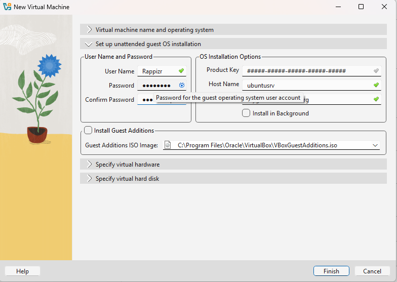

- 

- 

- 

- 

- 

- 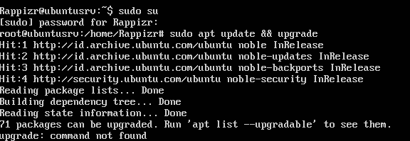

## 2. latihan 
2.1 latihan konseptual
1.1 jelaskan 5 fungsi utama sistem operasi dengan contoh konkret dari minimal 2 OS berbeda (Windows, macOS, atau Linux).
jawab : 
1. Manajemen Proses!
OS bertugas membagi jatah otak (CPU) ke aplikasi.

    Windows: Kalau ada aplikasi macet, kamu buka Task Manager (Ctrl+Shift+Esc) buat "End Task". Windows cenderung otomatis mengatur prioritas.

    Linux: Kamu lebih punya kendali penuh. Kamu bisa pakai perintah ps untuk lihat nomor identitasnya PID, lalu menghentikannya dengan kill. Linux sangat efisien menjalankan banyak proses di background.

2. Manajemen Memori!
OS mengatur siapa yang boleh pakai RAM.

    Windows: Punya fitur Virtual Memory, Kalau RAM habis, dia pakai harddisk buat bantu-bantu. Kadang terasa melambat kalau RAM-nya kecil.

    Linux: Punya area khusus namanya Swap Partition, Linux sangat pintar membebaskan RAM yang sudah tidak terpakai cache supaya sistem tetap enteng.

3. Manajemen File!
Cara kedua OS ini "merapikan lemari" sangat berbeda:

    Windows: Pakai sistem Drive (C:, D:, dst.). File sistemnya biasanya NTFS. Nama file Tugas.txt dan tugas.txt dianggap sama.

    Linux: Tidak ada Drive C:. Semuanya dimulai dari root. File sistemnya biasanya Ext4. Nama file Tugas.txt dan tugas.txt dianggap berbeda.

4. Manajemen I/O & Driver!
Gimana OS ngobrol sama mouse, printer, atau GPU.

    Windows: Kamu sering harus download file .exe atau .msi dari website resmi brand-nya supaya hardware jalan maksimal.

    Linux: Sebagian besar driver sudah menyatu di dalam Kernel. Jadi biasanya colok printer atau wifi langsung jalan tanpa instal apa-apa.

5. Manajemen Keamanan!
Benteng pertahanan OS.

    Windows: Karena penggunanya paling banyak, dia sering jadi sasaran virus. Makanya ada Windows Defender yang selalu standby scan file .exe.

    Linux: Keamanannya ketat di level Izin. Kamu tidak bisa mengubah sistem tanpa perintah sudo. Virus susah masuk karena file .exe Windows tidak bisa jalan di Linux secara langsung.

1.2 Kapan sebaiknya menggunakan Windows vs Linux vs macOS? Analisis berdasarkan use case: gaming, development, server, creative work, dan enter-prise.
jawab : 
### Analisis Pemilihan OS Berdasarkan Use Case

| Use Case | OS Utama | Alasan Utama |
| :--- | :--- | :--- |
| **Gaming** | Windows | Kompatibilitas game yang luas & dukungan Driver GPU terbaru. |
| **Development** | Linux / macOS | Lingkungan berbasis Unix yang stabil & ramah bagi programmer. |
| **Server** | Linux | Efisiensi tinggi, keamanan lebih terjaga, & bersifat open-source. |
| **Creative** | macOS | Ekosistem software kreatif yang matang & akurasi warna layar. |
| **Enterprise** | Windows | Dominasi aplikasi Office & kemudahan IT Management (Active Directory). |

## 2.2 Latihan Praktikal
2.1 Install Ubuntu Server 24.04.3 di VirtualBox dengan langkah berikut:
1. Download Ubuntu Server ISO dari website resmi
2. Create VM baru di VirtualBox (RAM: 2GB, Disk: 25GB)
3. Install dengan automatic partitioning (guided)
4. Buat user account dengan password yang kuat
5. Reboot dan login ke sistem
6. Dokumentasikan proses instalasi dengan screenshot key steps

jawab : tutorial sudah saya buat diatas

2.2 Setelah instalasi Ubuntu Server, lakukan tasks berikut:
1. Update package list: sudo apt update
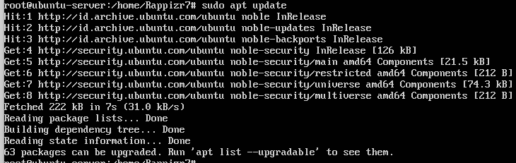

2. Upgrade packages: sudo apt upgrade
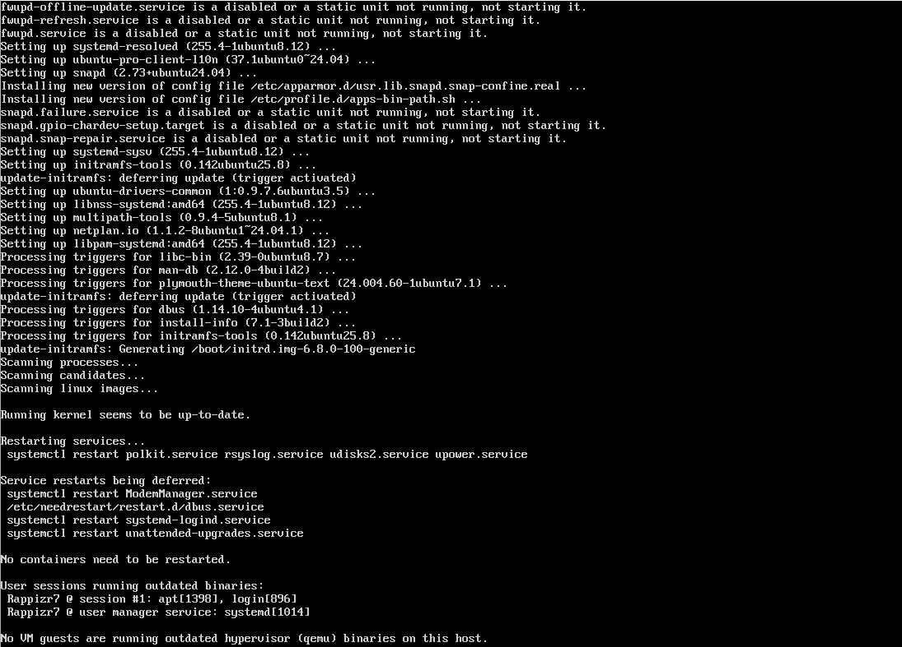

3. Install neofetch: sudo apt install neofetch
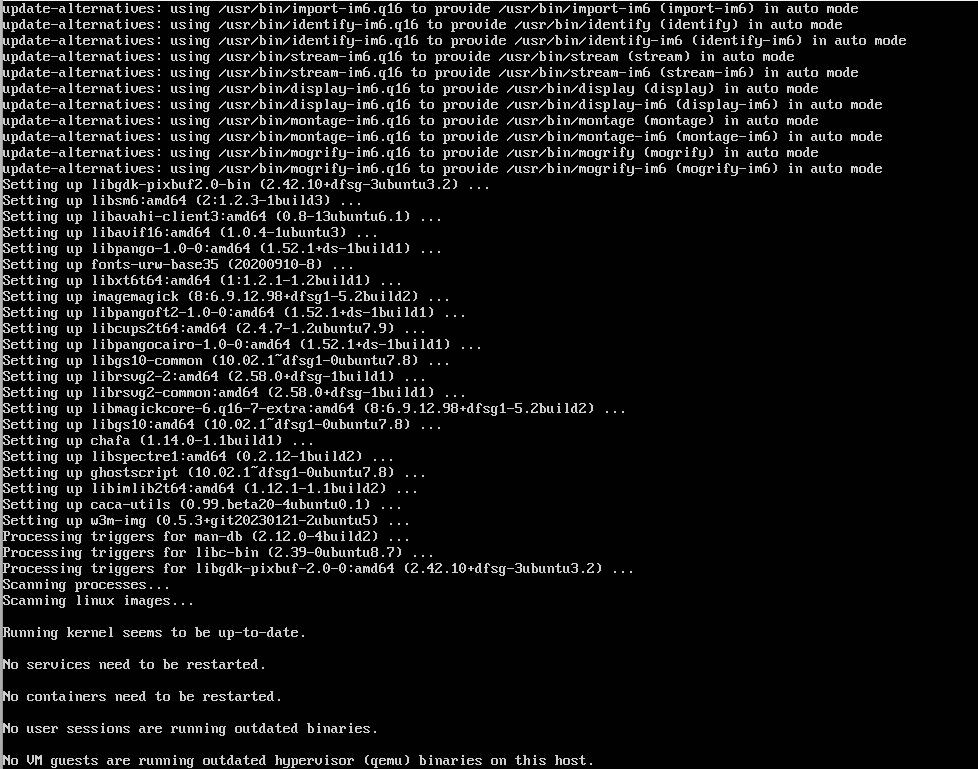

4. Jalankan neofetch dan screenshot hasilnya
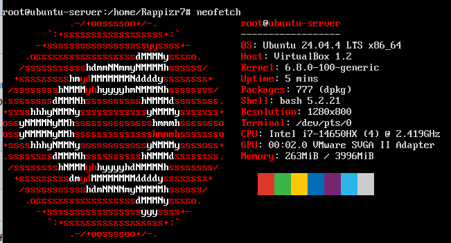

5. Check disk usage dengan df -h
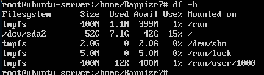

6. Check memory dengan free -h
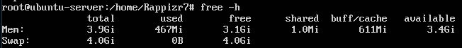

7. Dokumentasikan output dari setiap command
jawab : sudah

2.3 Eksplorasi sistem yang baru diinstall:
1. Tampilkan informasi OS: cat /etc/os-release
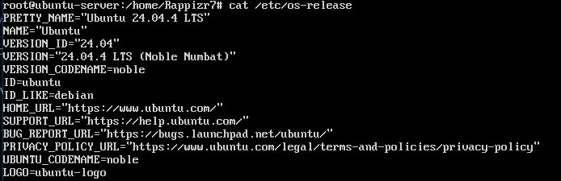
berdasarkan informasi yang saya lakukan informasi os saya memakai ubuntu versi 24.04

2. Tampilkan versi kernel: uname -r
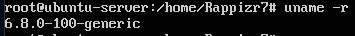
berdasarkan informasi yang saya lakukan kernel saya 6.8.0-100-generic

3. List partisi: lsblk
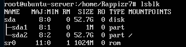
Berikut adalah struktur penyimpanan pada server:

| Nama | Ukuran | Jenis | Mountpoint |
| :--- | :--- | :--- | :--- |
| sda | 52.7G | Disk | - |
| sda2 | 52.7G | Partisi | / (Root) |

4. Check network connectivity: ping -c 4 google.com
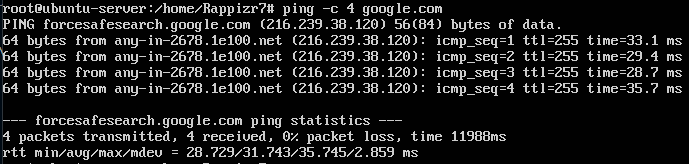
berdasarkan pengecekan /ping ke google tercatat berhasil tidak rto

5. Install dan jalankan htop untuk melihat resource usage
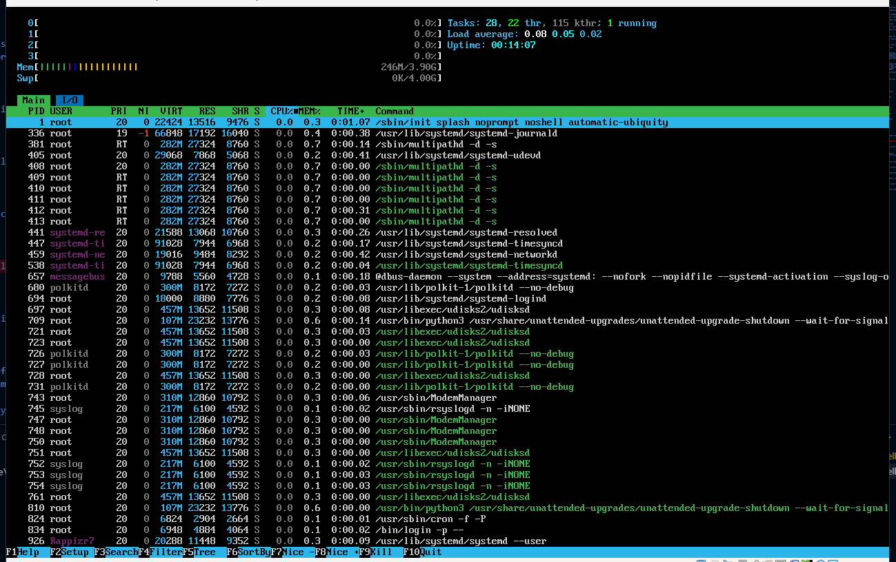
saya sudah menginstall sebelumnya jadi di foto yang saya lampirkan itu hasilnya resource usagenya

6. Buat laporan singkat tentang konfigurasi sistem Anda
jawab : sudah

## 2.3 Latihan Refleksi
Ceritakan pengalaman Anda dengan sistem operasi:
1. Sistem operasi apa yang Anda gunakan sehari-hari? (Windows, macOS,
Linux, atau lainnya)
jawab : 
secara harian aku memakai windows untuk kebutuhan sehari hari.

2. Berapa lama Anda menggunakan sistem operasi tersebut?
jawab :
saya memakai windows sejak belajar komputer ketika smk.

3. Apa yang Anda sukai dari sistem operasi tersebut?
jawab :
saya menyukai kemudahan instalasi aplikasi dan dukungan perangkat lunak untuk kebutuhan sehari hari yang sangat luas.

4. Apa tantangan atau masalah yang pernah Anda hadapi?
jawab :
masalah yang sering muncul adalah sistem yang terkadang melambat, proses update yang memakan waktu.

5. Apakah Anda pernah menggunakan sistem operasi lain? Bandingkan pengalaman Anda.
jawab :
saya sering menggunakan Ubuntu dan Proxmox. Hal ini karena latar belakang saya yang pernah bekerja di ISP sebagai Network Administrator/NOC.
Perbandingannya: Jika Windows unggul di sisi user interface, Proxmox unggul dalam hal virtualisasi. Di Proxmox, saya bisa mengelola banyak VM dengan sangat efisien. Sementara Ubuntu memberikan kontrol penuh melalui terminal/cli yang sangat stabil untuk menjalankan layanan jaringan dibandingkan Windows.

6. Setelah mempelajari bab ini, apakah ada sistem operasi lain yang ingin Anda coba? Mengapa?
jawab :
saya ingin meninkatkan kemampuan MikroTik RouterOS yang diinstal di dalam Proxmox. alasannya, saya ingin memperdalam optimasi traffic jaringan dan keamanan sistem pada level kernel yang lebih spesifikdan saya ingin memperdalam kemampuan saya.

Tulis refleksi Anda dalam 300-500 kata disertai dengan dokumentasi.
jawab : Pengalaman saya dengan sistem operasi merupakan perjalanan yang memadukan kebutuhan personal dengan tuntutan profesional di industri teknologi informasi. Sejak masa SMK, Windows telah menjadi sistem operasi utama yang saya gunakan. Kemudahan instalasi aplikasi dan dukungan perangkat lunak yang luas menjadikannya pilihan yang sangat praktis untuk produktivitas harian. Namun, seiring berjalannya waktu dan masuknya saya ke dunia kerja, pandangan saya terhadap sistem operasi mulai bergeser dari sekadar antarmuka grafis menjadi sebuah alat infrastruktur yang kritikal.

Titik balik terbesar dalam pengalaman saya adalah ketika saya bekerja di sebuah ISP (Internet Service Provider) sebagai Network Administrator atau NOC (Network Operations Center). Di lingkungan ini, keandalan adalah segalanya. Di sinilah saya mulai intensif bersentuhan dengan Ubuntu dan Proxmox VE. Bagi saya, Proxmox bukan sekadar "sistem operasi lain", melainkan sebuah hypervisor berbasis Linux (Debian) yang memungkinkan saya mengelola sumber daya server dengan efisiensi tinggi.

Membandingkan Windows dengan ekosistem Linux/Proxmox memberikan perspektif yang menarik. Windows memang unggul dalam hal User Interface yang ramah pengguna, namun ia sering kali menghadapi kendala efisiensi, seperti proses update yang memakan waktu dan penggunaan sumber daya yang terkadang membengkak tanpa alasan yang jelas. Sebaliknya, Ubuntu dan Proxmox menawarkan stabilitas yang luar biasa melalui Command Line Interface (CLI). Melalui terminal, saya merasa memiliki kendali penuh atas sistem tanpa beban overhead dari antarmuka grafis yang berat.

Salah satu momen teknis yang saya pelajari dalam praktikum ini, seperti penggunaan perintah lsblk untuk melihat partisi atau htop untuk memantau beban CPU, adalah rutinitas yang sangat akrab bagi seorang NOC. Perintah-perintah ini bukan sekadar baris kode, melainkan instrumen vital untuk memastikan kesehatan jaringan dan server. Menjalankan ping ke target seperti Google bukan hanya soal memeriksa internet, tetapi memastikan latensi berada dalam batas toleransi agar layanan pelanggan tetap prima.

Ke depannya, setelah mempelajari bab ini, saya tertantang untuk membawa kemampuan saya ke level yang lebih spesifik. Saya berencana melakukan eksperimen lebih dalam dengan MikroTik RouterOS yang diinstal di dalam lingkungan virtual Proxmox. Fokus saya adalah memperdalam optimasi traffic jaringan dan penguatan keamanan sistem pada level kernel. Bagi saya, sistem operasi bukan lagi sekadar platform untuk menjalankan aplikasi, melainkan sebuah ekosistem yang harus dioptimalkan untuk mendukung konektivitas global.

dokumentasi : 
dokumentasi saya meng oprek ubuntu
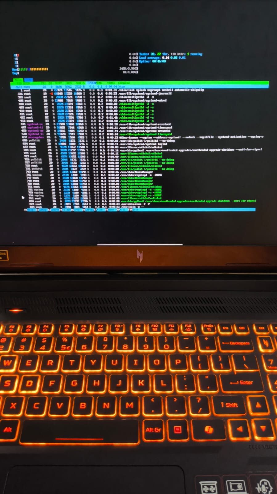